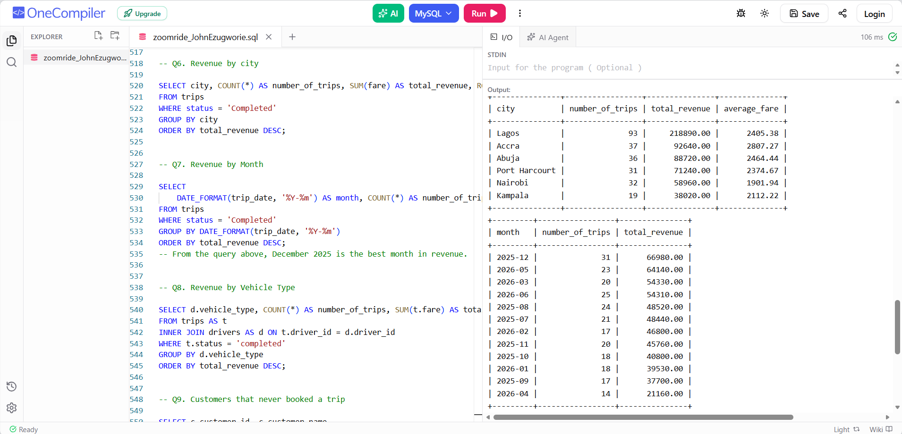

# ZoomRide Revenue Analysis (SQL)

## Project Overview
ZoomRide is a company that sells rides in cars and bikes, like Uber or Bolt. It works in 6 cities: Lagos, Abuja, Port Harcourt, Nairobi, Accra and Kampala.
This project focused on analyzing ride-hailing operations across the cities, involving data cleaning, exploration, and analysis of customer trips, drivers, cities, fares, and vehicle types.
The analysis aims to help the management understand: where they make the most revenue, when customers make the most trips, and which vehicle type generates the highest revenue. The insights generated can help ZoomRide understand business performance, identify demand patterns, and support data-driven operational decisions.

---

## Business Questions Answered
- Which city generates the highest revenue?
- Which month recorded the highest number of trips?
- Which vehicle type generates the most revenue?

---

## Key KPIs
- Total Revenue
- Completed Trips
- Average Fare
- Top-performing Vehicle type

---

## Tools Used
-OneCompiler
- MySql
- Sql Queries

---

## Analysis Preview

## Key Insights
- Lagos generates the highest total revenue due to the high number of trips.
- On average, Accra generates 2807.27 higher than Lagos(2405.38).
- Economy vehicle type generates the most revenue.
- Customers do make the most trips in the month of December.
- Total trips completed is 248, total revenue generated is 568,470, while average fare is 2344.32

---

## Files in this Repository
- [SQL Queries](ZoomRide_JohnEzugworie.sql)
- [Analysis Preview](ZoomRide_Screenshot_Preview_JohnEzugworie.png)
- README.md

---

## Conclusion

The ZoomRide analysis provided useful insights into revenue and ride performance across the six operating cities. Lagos generated the highest total revenue of 218,890, largely driven by its higher number of trips, while Accra recorded the highest average fare of 2,807.27 compared with Lagos at 2,405.38, suggesting an opportunity for ZoomRide to further investigate and invest in the Accra market.

However, the analysis also identified duplicate records, spelling inconsistencies, additional spaces, and missing fares on completed trips. These data-quality issues could distort revenue, trip counts, and other performance metrics, potentially leading to poor business decisions. Therefore, the missing fares should be recovered and imputed where appropriate, and the data should be fully cleaned and validated before major strategic decisions are made.
